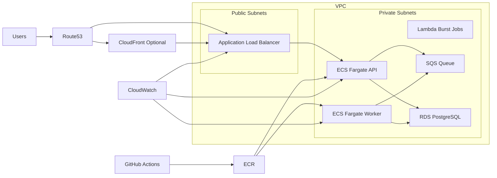

# Cost-Efficient Production-Grade AWS Infrastructure Using Terraform

[](https://github.com/JamesUgbanu/aws-terraform-cost-efficient-production-infra/actions/workflows/terraform-plan.yml)
[](https://github.com/JamesUgbanu/aws-terraform-cost-efficient-production-infra/actions/workflows/terraform-apply.yml)

Public starter infrastructure for startups and small SaaS teams that want a
production-conscious AWS baseline without Kubernetes complexity or expensive
defaults.

This repo is for teams building NestJS APIs, Next.js backends, SaaS platforms,
fintech products, AI APIs, internal tools, and background workers that need to
ship reliably while staying cost-aware.

Suggested GitHub topics:
`terraform`, `aws`, `ecs`, `fargate`, `rds`, `startup-infrastructure`,
`cost-optimization`, `nestjs`, `saas`, `devops`, `github-actions`

## Why ECS Fargate Instead Of Kubernetes

For most early-stage teams, ECS Fargate is the better default because:

- it removes cluster operations overhead
- it is easier to understand and onboard to
- it supports clean container-based deployments
- it keeps the scaling story straightforward
- it lets small teams focus on product instead of platform mechanics

Kubernetes is powerful. It is just usually too much, too early.

## What Is Included

- layered Terraform structure for production-style ownership boundaries
- VPC, subnets, routing, optional NAT, and baseline security groups
- ECR repositories with lifecycle cleanup
- ALB with HTTP and optional HTTPS
- ECS Fargate API and worker service patterns
- PostgreSQL on RDS with cost-conscious defaults
- minimal CloudWatch-based observability
- GitHub Actions OIDC deployment setup
- Mermaid diagrams rendered natively by GitHub

## What Is Intentionally Excluded

- Kubernetes and EKS
- service mesh
- Redis by default
- NAT Gateway by default
- X-Ray by default
- expensive third-party observability tooling
- multi-account platform complexity

## High-Level Architecture



Request flow is simple: DNS resolves to the ALB, the ALB sends traffic to the
API ECS service, the API talks to PostgreSQL for transactional work, and async
jobs are pushed to SQS for worker processing.

## Features

- production-ready layered structure
- startup-friendly defaults
- low-cost first deployment path
- GitHub Actions ready
- least-privilege IAM baseline
- optional private subnet path when you are ready for it

## Deploy This

If you want the smallest realistic path, start with the minimal example guide:

```bash
cd infra/examples/minimal
cat README.md
```

Then apply the real Terraform layers in order:

```bash
cd ../../layers/1-bootstrap
cp backend.tf.example backend.tf
cp terraform.tfvars.example terraform.tfvars
terraform init
terraform plan
terraform apply
```

Repeat that pattern for:

- `infra/layers/2-network`
- `infra/layers/3-platform`
- `infra/layers/4-application`
- `infra/layers/5-observability`

## Folder Structure

```text
.
├── .github/workflows/
├── docs/
├── infra/
│   ├── examples/
│   ├── layers/
│   │   ├── 1-bootstrap/
│   │   ├── 2-network/
│   │   ├── 3-platform/
│   │   ├── 4-application/
│   │   └── 5-observability/
│   └── modules/
└── README.md
```

## Architecture

See:

- [docs/architecture.md](./docs/architecture.md)
- [docs/assets/high-level-architecture.md](./docs/assets/high-level-architecture.md)
- [docs/assets/request-flow.md](./docs/assets/request-flow.md)
- [docs/assets/deployment-flow.md](./docs/assets/deployment-flow.md)
- [docs/assets/cicd-workflow.md](./docs/assets/cicd-workflow.md)

## Quick Start

1. Copy each `backend.tf.example` and `terraform.tfvars.example` file into real
   `backend.tf` and `terraform.tfvars` files.
2. Fill in your AWS account values, repository details, subnet IDs, and secret
   ARNs.
3. Apply layers in order from `1-bootstrap` through `5-observability`.
4. Start with a single API service and only add workers, private egress, or
   extra caching when the workload proves it needs them.

## Deployment Steps

```bash
cd infra/layers/1-bootstrap
terraform init
terraform plan -var-file=terraform.tfvars.example

cd ../2-network
terraform init
terraform plan -var-file=terraform.tfvars.example
```

Repeat for the remaining layers after replacing example values with real ones.

## Cost Estimates

The intended starting envelope is roughly `$60 to $100/month` for a modest
production workload, with observability kept near `$5 to $10/month`.

| Service | Monthly estimate |
| --- | --- |
| ECS Fargate API | `$10 to $25` |
| ECS Fargate worker | `$10 to $25` |
| ALB | `$18 to $25` |
| RDS PostgreSQL | `$15 to $30` |
| CloudWatch | `$5 to $10` |
| ECR, secrets, and storage | `$1 to $5` |

Read [docs/cost-estimate.md](./docs/cost-estimate.md) before enabling:

- NAT Gateway
- Multi-AZ RDS
- longer log retention
- heavier autoscaling

## Security Notes

- no long-lived AWS keys in CI
- no secrets committed to the repo
- GitHub Actions authenticates through OIDC
- RDS is private by default
- IAM is intentionally narrow rather than magical

More detail lives in [docs/security.md](./docs/security.md).

## Scaling Strategy

- scale the API service first
- split background workers by job type when contention appears
- default to SQS for async processing before reaching for Redis
- add Redis only when caching or queue patterns actually need it
- move to Kubernetes only when ECS becomes a real bottleneck, not as a status symbol

## When Not To Use This

Do not use this starter if you already know you need:

- multi-region active-active infrastructure
- heavy compliance controls from day one
- very high-throughput workloads with complex platform networking
- a dedicated platform engineering team operating Kubernetes or service mesh
- deep cloud portability with a lowest-common-denominator abstraction strategy

## Terraform Workflow

- keep layers separate
- review plans by layer
- keep state small
- promote explicit, reviewable changes

## GitHub Actions Workflow

- pull requests run `terraform fmt`, `init`, `validate`, and `plan`
- applies run only by manual dispatch
- workflows rely on OIDC and documented repository variables

## Rollback Strategy

- roll back app images first
- prefer forward fixes for Terraform when safe
- treat database rollback as a data recovery exercise, not an infrastructure toggle

See [docs/rollback.md](./docs/rollback.md).

## Security Philosophy

Secure enough to be production-conscious, simple enough to operate without a
dedicated platform team.

## Cost-Saving Philosophy

Avoid paying for complexity before the business needs it.

## Future Improvements

- remote state bootstrap automation
- optional ElastiCache module
- Route53 and ACM modules
- blue-green ECS deployment examples
- SQS and EventBridge modules
- private networking mode with VPC endpoints enabled

## Roadmap

See [ROADMAP.md](./ROADMAP.md) for the next set of practical improvements that
would make this repo even more useful for public forks.
