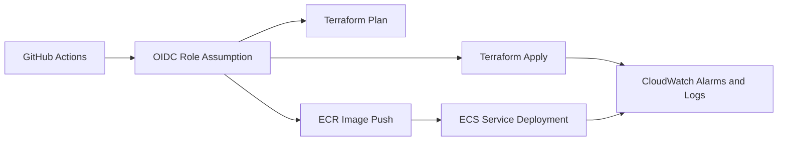

# CI/CD Workflow

```mermaid
flowchart LR
    GitHub[GitHub Actions] --> OIDC[OIDC Role Assumption]
    OIDC --> TFPlan[Terraform Plan]
    OIDC --> TFApply[Terraform Apply]
    OIDC --> ECRPush[ECR Image Push]
    ECRPush --> ECSDeploy[ECS Service Deployment]
    TFApply --> CW[CloudWatch Alarms and Logs]
    ECSDeploy --> CW
```
