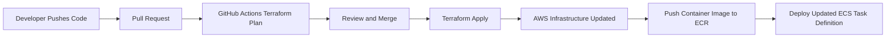

# Deployment Flow

```mermaid
flowchart LR
    Dev[Developer Pushes Code] --> PR[Pull Request]
    PR --> Plan[GitHub Actions Terraform Plan]
    Plan --> Review[Review and Merge]
    Review --> Apply[Terraform Apply]
    Apply --> Infra[AWS Infrastructure Updated]
    Infra --> ECR[Push Container Image to ECR]
    ECR --> ECS[Deploy Updated ECS Task Definition]
```
