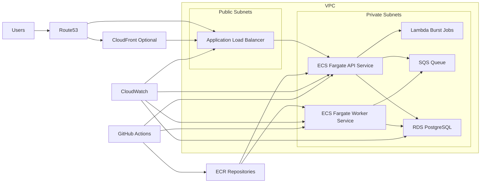

# High-Level Architecture

```mermaid
flowchart LR
    User[Users] --> Route53[Route53]
    Route53 --> CloudFront[CloudFront Optional]
    Route53 --> ALB[Application Load Balancer]
    CloudFront --> ALB

    subgraph VPC[VPC]
      subgraph Public[Public Subnets]
        ALB
      end
      subgraph Private[Private Subnets]
        API[ECS Fargate API Service]
        Worker[ECS Fargate Worker Service]
        Lambda[Lambda Burst Jobs]
        SQS[SQS Queue]
        RDS[RDS PostgreSQL]
      end
    end

    ALB --> API
    API --> RDS
    API --> SQS
    Worker --> SQS
    Worker --> RDS
    API --> Lambda

    ECR[ECR Repositories] --> API
    ECR --> Worker
    CW[CloudWatch] --> API
    CW --> Worker
    CW --> ALB
    CW --> RDS
    GitHub[GitHub Actions] --> ECR
    GitHub --> API
    GitHub --> Worker
```
