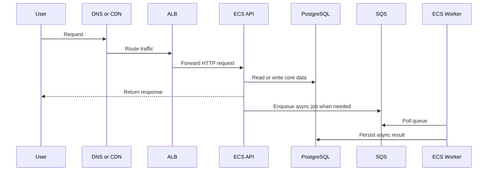

# Request Flow

```mermaid
sequenceDiagram
    participant U as User
    participant D as DNS or CDN
    participant A as ALB
    participant API as ECS API
    participant DB as PostgreSQL
    participant Q as SQS
    participant W as ECS Worker

    U->>D: Request
    D->>A: Route traffic
    A->>API: Forward HTTP request
    API->>DB: Read or write core data
    API-->>U: Return response
    API->>Q: Enqueue async job when needed
    W->>Q: Poll queue
    W->>DB: Persist async result
```
